# 比特币系统流程图解析

本文档通过一系列流程图来解释比特币系统的核心机制。

## 1. 基础架构

### 1.1 区块链结构
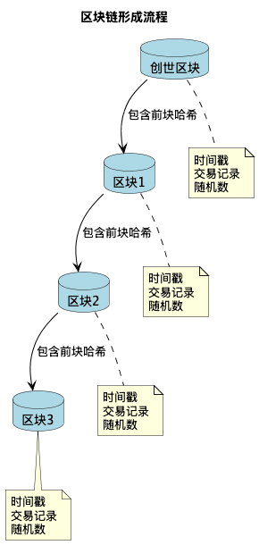

区块链是比特币系统的核心数据结构，通过哈希链接形成不可篡改的账本。每个区块包含：
- 时间戳
- 交易记录
- 随机数(Nonce)
- 前块哈希值

### 1.2 交易流程
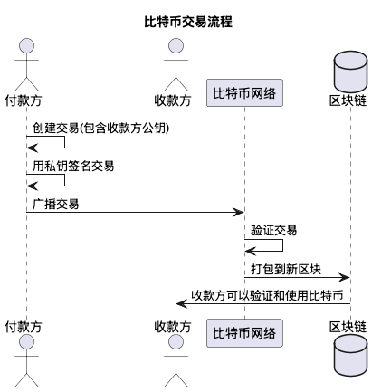

基本交易流程包括：
- 付款方创建并签名交易
- 通过网络广播
- 由矿工验证并打包
- 收款方确认交易

### 1.3 Merkle树结构
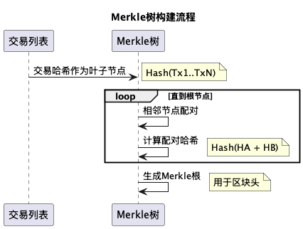

Merkle树用于：
- 高效验证交易
- 支持轻节点验证
- 优化区块存储

### 1.4 UTXO模型
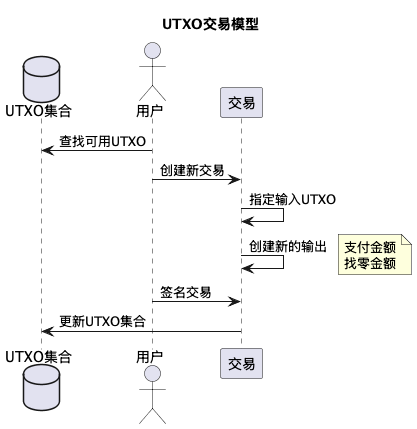

UTXO（未花费交易输出）模型：
- 追踪所有可用币
- 防止双重支付
- 保证交易有效性

## 2. 挖矿与共识

### 2.1 挖矿流程
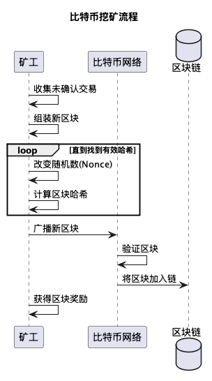

挖矿过程包括：
- 收集未确认交易
- 组装新区块
- 通过改变随机数寻找有效哈希
- 广播新区块获得奖励

### 2.2 区块验证
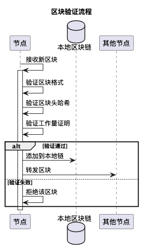

节点在接收新��块时会进行：
- 格式验证
- 区块头哈希验证
- 工作量证明验证

### 2.3 网络共识
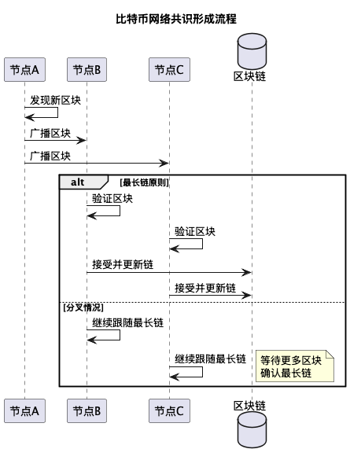

网络通过以下机制达成共识：
- 最长链原则
- 区块广播
- 分叉处理

## 3. 安全机制

### 3.1 双重支付防护
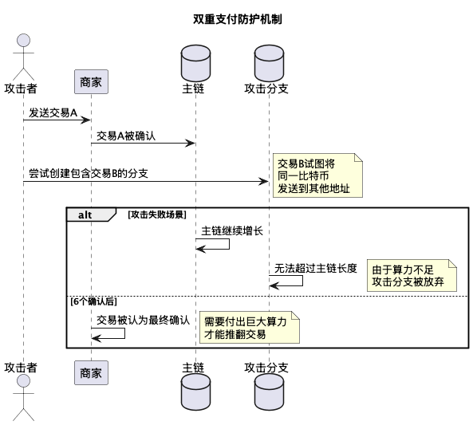

通过以下机制防止双重支付：
- 交易确认机制
- 6确认原则
- 算力保障

### 3.2 简化支付验证(SPV)
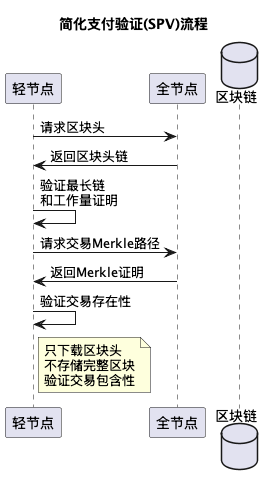

轻节点通过SPV机制验证交易：
- 只下载区块头
- 使用Merkle证明
- 验证交易包含性

## 4. 经济模型

### 4.1 区块奖励
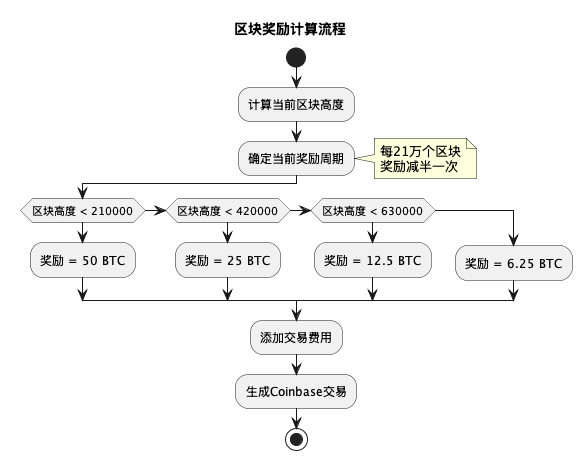

区块奖励机制：
- 初始50 BTC
- 每21万个区块减半
- 最终总量2100万

### 4.2 交易费用市场
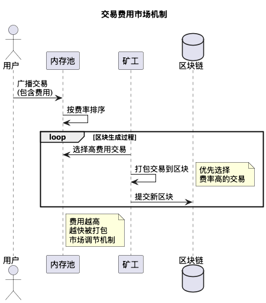

费用市场机制：
- 按费率排序
- 优先打包高费用交易
- 市场调节原则

## 5. 网络传播

### 5.1 数据传播机制
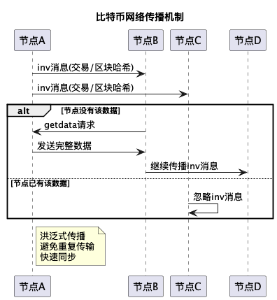

网络传播特点：
- inv/getdata协议
- 洪泛式传播
- 避免重复传输

## 总结

这些流程图展示了比特币系统的主要组成部分：
1. 基础架构保证了系统的可用性
2. 挖矿与共识机制确保了系统的安全性
3. 经济模型提供了激励机制
4. 网络传播保证了系统的效率

每个组件都经过精心设计，共同构建了一个去中心化电子现金系统。 