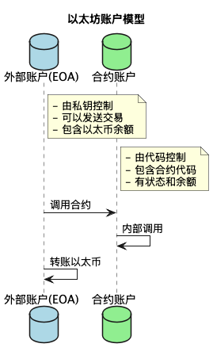
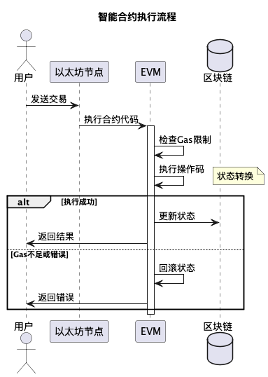
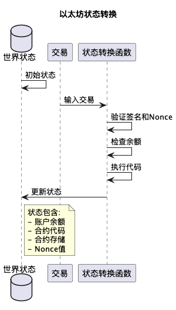
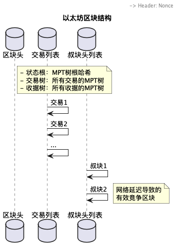
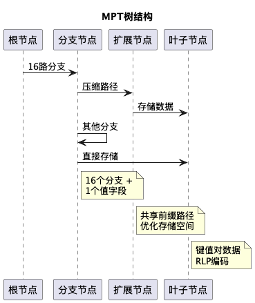
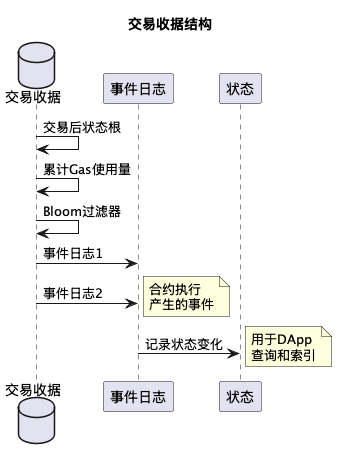
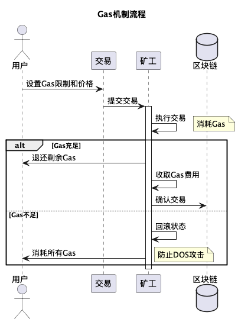
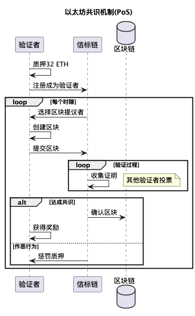
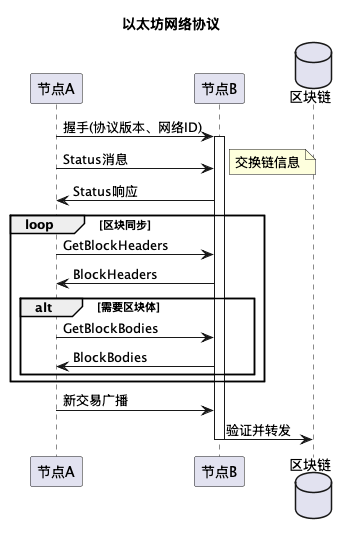

# 图解以太坊

## 目录
- [1. 基础架构](#1-基础架构)
  - [1.1 账户模型](#11-账户模型)
  - [1.2 智能合约](#12-智能合约)
  - [1.3 状态转换](#13-状态转换)
  - [1.4 区块结构](#14-区块结构)
  - [1.5 MPT树结构](#15-mpt树结构)
  - [1.6 交易收据](#16-交易收据)
- [2. 经济模型](#2-经济模型)
  - [2.1 Gas机制](#21-gas机制)
- [3. 共识机制](#3-共识机制)
  - [3.1 权益证明(PoS)](#31-权益证明pos)
- [4. 网络层](#4-网络层)
  - [4.1 网络协议](#41-网络协议)

## 1. 基础架构

### 1.1 账户模型

以太坊使用账户模型而不是UTXO模型：
- 外部账户(EOA)：由用户控制
- 合约账户：由代码控制
- 两种账户都可以持有以太币和代币

### 1.2 智能合约

智能合约执行流程：
- 用户发送交易调用合约
- EVM执行合约代码
- 基于Gas限制控制执行
- 更新状态或回滚

### 1.3 状态转换

状态转换机制：
- 维护全局状态树
- 交易触发状态转换
- 验证和执行规则
- 原子性状态更新

### 1.4 区块结构

以太坊区块包含：
- 区块头：包含元数据和各种树根
- 交易列表：本区块包含的所有交易
- 叔块头列表：网络延迟导致的有效竞争区块

### 1.5 MPT树结构

MPT(Merkle Patricia Trie)特点：
- 高效的键值存储
- 默克尔树验证能力
- 压缩路径节省空间

### 1.6 交易收据

交易收据用途：
- 记录交易执行结果
- 存储事件日志
- 支持轻客户端查询

## 2. 经济模型

### 2.1 Gas机制

Gas机制特点：
- 计算资源定价
- 防止无限循环
- 激励机制
- DOS攻击防护

## 3. 共识机制

### 3.1 权益证明(PoS)

PoS共识特点：
- 验证者质押机制
- 随机选择提议者
- 投票确认区块
- 奖惩机制

## 4. 网络层

### 4.1 网络协议

网络协议功能：
- 节点发现和连接
- 区块和交易同步
- 状态同步机制

## 总结

以太坊通过这些机制实现了：
1. 图灵完备的智能合约平台
2. 高效的状态管理
3. 经济可持续的资源定价
4. 环保的共识机制 